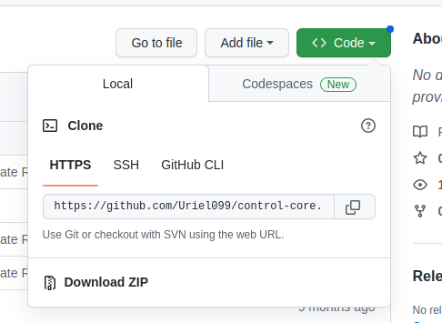

# Como configurar y hacer correr el proyecto que les voy a pasar.

les enviaré una invitación para colaborar en un proyecto de github, una vez que acepten la invitación podrán clonar el proyecto en su computadora y comenzar a modificar los endpoints ya creados.

para clonar su repositorio hay que ejecutar el comando.

~~~ bash
git clone <repositorio>
~~~

el repositorio hay que cambiarlo por lo siguiente: se tienen que dirigir a la parte de <> code en github y les da la opcion de clonarlo mediante https o ssh, si se quiere hacer por ssh hay que configurar la llave ssh previamente.

Luego de eso copiamos el vinculo y lo pegaremos en el comando de git clone.

Una vez con el repositorio clonado si tratamos de correrlo con el siguiente comando:

~~~ bash
> node app.js
~~~

la razón por la que no correrá es por que no se encuentran instaladas las dependencias, esto es por que si nos fijamos en el archivo .gitignore establecí que ignorará el directorio de node_modules que es donde se guardan las dependencias la razon es que en este directorio se guardan tantos archivos y subdirectorios que el proceso de carga y descarga del repositorio sería muy tardado además que no es recomendable.

entonces ejecutaremos el siguiente comando:

~~~ bash
> npm install
~~~

este comando se encargará de instalar las dependencias que estan definidas en el package.json y despues de eso nuetra aplicación podrá correr sin problemas.
