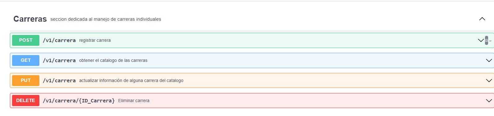
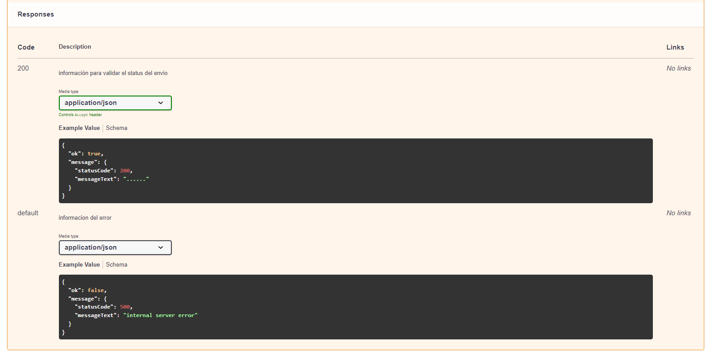

# Guia general de node - express

## Glosario

* **Node JS** es una tecnologia que permite ejecutar javascript en entornos de escritorio por que recordemos que javascript fue creado para ser ejecutado por navegadores web.

* **NPM** es el gestor de paquetes de node js y a su vez es el repositorio de código abierto más grande del mundo haciendo posible que podamos utilizar código de este repositorio como dependencias de nuestro codigo.

    para instalar dependencias hacemos uso del siguiente comando:
    ~~~ bash
    > npm install <nombre de dependencia>
    ~~~ 

* **Express** es el framework para desarrollar aplicaciones web que utilizaremos para crear nuestras aplicaciones backend ya que esta permite crear aplicaciones web gráficas así como únicamente endpoints.

* **Endpoint** es una parte muy importante de nuestro backend ya que este engloba a las rutas por las que el frontend accedera a las funcionalidades de la aplicacion y la funcionalidad en si.

## Swagger

### secciones

dentro de la representacion se encuentran las secciones que por lo regular tendremos una seccion por cada tabla en la base de datos

la seccion cuenta con una breve descripción y los endpoints que deberá tener.

### parametros

cuando damos clic en un endpoint cuenta igualmente con una breve descripción y con una seccion de parametros:

los parametros son datos que tienen que ser enviados ya sea por el path (url) o header, los parametros son datos que llegan a nuestro endpoint mientras no sean parte del request body.

por sierto las peticiones get y delete no pueden tener request body es por eso que los datos que recibimos por estas peticiones son unicamente por los parametros.

### request body

el request body se define debajo de los parametros, ahí mismo defino en json los datos que recibiremos en el endpoint y además ahí les explico las validaciónes que tendrán que realizar para registrar o actulizar datos en la base de datos.

### responses

y por ultimo tenemos los responses, ahí aparecen los datos en formato json que tendrán que devolver y tambien los codigos http.

## estructura de proyecto node js

Si querermos que nuestros proyectos en node puedan crecer sin ser un completo desastre entonces debemos de dividir el proyecto en partes y no tener toda la funcionalidad en un solo archivo de javascritpt.

esto es posible gracias a la funcionalidad import/export de javascript que permite poder usar código de otros archivos en la aplicación.

ejemplo:

archivo1.js
~~~ js
const funcionFlecha = (nombre) => {
    console.log("hola mundo "+nombre);
}

module.exports = { funcionFlecha }
~~~

con module exports podemos exportar funciones y variables.

archivo2.js
~~~ js
const {funcionFlecha} = require('./archivo1.js')

funcionFlecha("tsj");
~~~

especificando entre llaves la funcion o variable que queremos importar y especificando la ubicación del archivo podemos importar código de otros archivos. Si no se exporta entonces no se puede importar

si ejecutamos el archivo con node entonces tendremos la siguiente salida:

~~~ 
> node archivo2.js
hola mundo tsj
>
~~~

Gracias a esta funcionalidad podemos dividir el proyecto.

### Servidor
el archivo donde se definirá nuestra aplicacion es en una clase de javascript con los métodos y atributos necesarios para hacer nuestra aplicación

~~~ js
const express = require('express');
const {port} = require('../env');

class Server {
    constructor() {
        this.app = express();
        this.port = port;
        this.Server = require('http').createServer(this.app);
            
        this.paths = {
            modulo: '/v1/modulo/'
        }
        
        this.middlewares();
        this.routes();
    }

    middlewares() {
        this.app.use(express.json());
    }

    routes() {
        this.app.use(this.paths.modulo, require('../routes/modulo-routes'));
    }

    listen() {
        this.Server.listen( this.port, () => {
            console.log('Servidor corriendo en puerto', this.port );
        });
    }
}

module.exports = {
    Server
}
~~~

### app.js

dentro de este archivo se importa y crea una instancia de nuestra clase ademas se ejecuta el método listen que hace que nuestra aplicación se ejecute.

~~~ js
const {Server} = require('./models/server');

const server = new Server();

server.listen();
~~~

### Rutas

Definiremos nuestras rutas en el directorio routes/ ahí crearemos un archivo inicializando el router de express definiendo los métodos http y exportando el router.

~~~ js
const express = require("express");
const router = express.Router();

const {body} = require("express-validator");

const {registrar_modulo, obtener_modulo, actualizar_modulo, deshabilitar_modulo} = require("../controller/modulo-controller");

router.post('/', 
    body("idModulo").isString(),
    body("nombre").isString(), 
    body("version").isString(),
    body("descripcion").isString(),
    body("opcion").isString(),
    registrar_modulo);

router.get('/', obtener_modulo);

router.put('/', 
    body("idModulo").isString(),
    body("nombre").isString(), 
    body("version").isString(),
    body("creado").isDate(),
    body("descripcion").isString(),
    body("opcion").isString(),
    actualizar_modulo);

router.delete('/:idModulo', deshabilitar_modulo);

module.exports = router;
~~~

Así mismo la funcion de la ruta se importa del controlador.

### Base de datos

Para manejar la base de datos mariadb que utilizaremos se tiene que hacer uso de la dependencia de mariadb para node js, la configuración de la base de datos se hace de la siguiente manera:

~~~ js
const mariadb = require('mariadb');

const pool = mariadb.createPool({
    host: host, 
    port: port,
    user: user, 
    password: password,
    database: database
});

module.exports = pool
~~~

se importa la dependencia de mariadb y creamos el pool que es un objeto y createPool es el método constructor y que nos provee de distintos métodos para operar nuestra base de datos y por último para utilizarla en distintas partes de nuestra aplicacion exportamos el pool.

### Controlador

los controladores se situan dentro del directorio controller/ y aqui es donde se programa el funcionamiento del endpoint, para recibir y enviar datos al cliente nuestras funciones deberán tener como argumentos req y res que son la abreviatura de request y response.

~~~ js
const obtener_modulo = (req, res) => {
    const {id, nombre} = req.body;
    res.status(200).json({
        'id': id,
        'nombre': nombre
    })
}
~~~

Así se ve un controlador completo que valida los datos con express validator, hace una consulta a la base de datos y regresa una respuesta al cliente

~~~ js
const registrar_modulo = async (req, res) => {
    const validation_errors = validationResult(req);
    if (!validation_errors.isEmpty()) {
        const response = return_error(406, 'Datos con formato incorrecto');
        return res.status(400).json(response);
    }

    const {idModulo, nombre, version, descripcion, opcion} = req.body;

    try{
        await pool.getConnection().then(async (conn) => {
            const consulta = await conn.query("CALL registrarModulo(?, ?, ?, ?, ?)", [idModulo, nombre, version, descripcion, opcion]);
            
            conn.end();
            
            if(consulta[0][0].Result === 0){ 
                const response = return_error(402, consulta[0][0].Descripcion);
                return res.status(400).json(response);
            }
            
            return res.status(200).json({
                'ok': true,
                'message': {
                    'status': 200, 
                    'message': consulta[0][0].Descripcion
                }
            });
        });
    }catch(err){
        console.log(err);
        const error = return_error(500, 'internal server error');
        return res.status(500).json(error);
    }
}
~~~

es my importante que cuando se abre una conexión a la base de datos esta se cierre con el metodo conn.end(); ya que de no cerrarse la conexion la aplicación se estará deteniendo a cada rato por que estará acabando con la memoria ram del equipo host.

### Helpers

Los helpers son fragmentos de código que realizan una funcion que nosotros determinemos que se utilizá varias veces en nuestra aplicación, encapsulamos el código en una funcion y archivo de javascript independiente y exportamos esa funcion.

~~~ js 
const return_error = (codigo, mensaje) => {
    return {
        'ok': false,
        'message': {
            'status': codigo,
            'error_text': mensaje
        }
    };
}

module.exports = {
    return_error
}
~~~